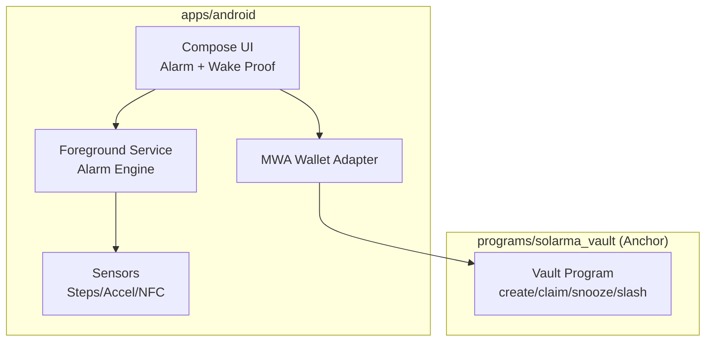

# Solarma

> Seeker-first Android alarm app with optional Solana onchain commitment vault. Wake up or lose your deposit.

## Tech Stack

| Component | Version | File/Tool |
|-----------|---------|-----------|
| Rust | stable (1.75+) | `rust-toolchain.toml` |
| Anchor CLI | ^0.29.0 | cargo install |
| Solana CLI | ^1.18.0 | local testing |
| Node.js | ^18.0.0 | Anchor TS tests |
| Kotlin | 1.9.x | Android code |
| AGP | 8.2.x | Android Gradle Plugin |
| compileSdk | 34 | Android 14 |
| minSdk | 26 | Android 8.0 |

## Commands

```bash
make init       # Install/verify toolchain, generate env
make format     # Format all code (Kotlin + Rust)
make lint       # Run linters
make typecheck  # Run static analysis
make test       # Run all tests (Anchor + Android unit)
make build      # Build all (APK + program)
make run        # Start dev environment
make clean      # Safe cleanup
```

## Architecture



## Directory Structure

```
solarma/
├── .ai/                    # Agent context (Memory Bank, roles)
│   ├── memory-bank/        # Persistent project knowledge
│   ├── roles/              # Agent role definitions
│   └── templates/          # ADR, test templates
├── .gemini/                # Antigravity config
├── .github/workflows/      # CI/CD
├── apps/android/           # Android app (Kotlin + Compose)
├── programs/solarma_vault/ # Anchor program (Rust)
├── packages/shared/        # Shared utilities (minimal)
├── scripts/                # Build/CI utilities
├── docs/                   # Architecture, runbook
└── configs/                # Environment configs
```

## Coding Conventions

### General
- **Naming**: camelCase (Kotlin), snake_case (Rust)
- **Imports**: grouped, sorted alphabetically
- **Max line length**: 100 chars
- **No magic numbers**: use named constants

### Kotlin
- Use Jetpack Compose for UI
- Use Hilt for DI
- Use `Result<T>` for operations that can fail
- Prefer `sealed class` for state

### Rust/Anchor
- Use `thiserror` for custom errors
- One instruction per file (when complex)
- Document all public items
- Test invariants explicitly

### Logging
- Structured logs only (no raw println)
- No PII in logs
- Include correlation IDs for transactions

### Error Handling
- Always provide user-visible error message
- Log technical details separately
- Never swallow exceptions silently

## Protected Files

> ⚠️ Do not modify without ADR approval:

- `.github/workflows/ci.yml` — CI pipeline
- `scripts/safe_run.sh` — Safety guardrails
- `programs/solarma_vault/src/lib.rs` — Core contract entry
- `SECURITY.md`, `PRIVACY.md` — Policy documents

## Agent Entry Points

- **Start here**: Read `AGENTS.md` (this file)
- **Current context**: `.ai/memory-bank/activeContext.md`
- **Progress**: `.ai/memory-bank/progress.md`
- **Patterns**: `.ai/memory-bank/systemPatterns.md`
- **Decisions**: `.ai/memory-bank/decisionLog.md`
