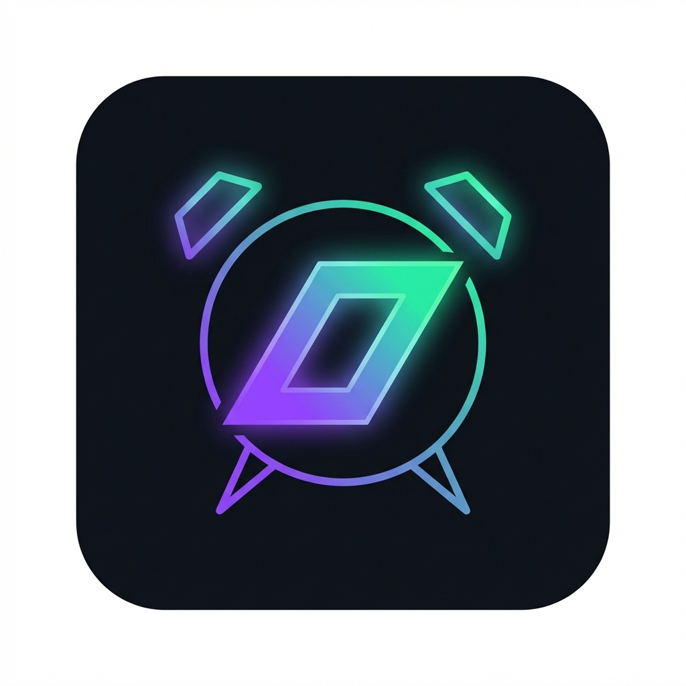

<p align="center">
  
</p>

<h1 align="center">Solarma</h1>

<p align="center">
  <strong>Wake-proof alarm with SOL commitment vault</strong><br>
  <sub>Built for <a href="https://solanamobile.com/seeker">Solana Seeker</a></sub>
</p>

<p align="center">
  <a href="#features">Features</a> · 
  <a href="#how-it-works">How It Works</a> · 
  <a href="#quick-start">Quick Start</a> · 
  <a href="#architecture">Architecture</a> · 
  <a href="#contributing">Contributing</a>
</p>

---

## Features

**Commitment-Based Alarm** — Stake SOL to back your wake-up promise

**Native Android** — Optimized for Solana Seeker hardware

**Non-Custodial** — Your keys, your funds via Mobile Wallet Adapter

**Wake Verification** — Prove you're awake with NFC, QR scan, or step counter

**Flexible Penalties** — Choose burn, donate, or send to accountability buddy

**Permissionless Slash** — Anyone can trigger penalty after deadline passes

---

## How It Works

```
                    SOLARMA FLOW
                    
     CREATE          ALARM           CLAIM
    + Stake   ───▶   TIME    ───▶   Success
      SOL                           (get SOL back)
                       │
                       ▼
                    SNOOZE?         SLASH
                    (-10%)   ───▶   Failure
                                    (penalty applied)
```

1. **Create alarm** with SOL deposit (minimum 0.001 SOL)
2. **Wake up** before deadline and complete verification
3. **Claim** your full deposit back
4. **Or fail** — deposit routes to penalty destination

---

## Quick Start

### Prerequisites
- Android Studio Hedgehog or later
- Rust with Anchor CLI 0.32+
- Solana CLI 1.18+
- Node.js 18+

### Build Android App
```bash
cd apps/android
./gradlew assembleDebug
```
APK output: `app/build/outputs/apk/debug/app-debug.apk`

### Build Smart Contract
```bash
cd programs/solarma_vault
anchor build
anchor test
```

### Using Makefile
```bash
make build        # Build all components
make test         # Run test suite
make deploy-dev   # Deploy to devnet
```

---

## Architecture

```
solarma/
├── apps/android/          # Kotlin + Jetpack Compose
│   ├── wallet/            # MWA integration
│   ├── alarm/             # AlarmManager + WorkManager
│   └── wakeproof/         # NFC / QR / Step verification
│
├── programs/solarma_vault/  # Anchor program
│   ├── instructions/      # create, claim, snooze, slash
│   └── state/             # Alarm, Vault, UserProfile
│
└── docs/                  # Technical documentation
```

See [ARCHITECTURE.md](docs/ARCHITECTURE.md) for detailed system design.

### Smart Contract Instructions

| Instruction | Description |
|-------------|-------------|
| `initialize` | Create user profile |
| `create_alarm` | Create alarm and deposit SOL to vault |
| `claim` | Reclaim deposit after alarm time, before deadline |
| `snooze` | Extend deadline with 10% penalty (doubles each use) |
| `emergency_refund` | Cancel before alarm time with 5% penalty |
| `slash` | Permissionless penalty trigger after deadline |

**Program ID (Devnet)**
```
51AEPs95Rcqskumd49dGA5xHYPdTwq83E9sPiDxJapW1
```

---

## Roadmap

| Phase | Timeline | Milestones |
|-------|----------|------------|
| **Open Beta** | Q2 2026 | Community testing, social features |
| **Mainnet** | Q3 2026 | USDC deposits, leaderboards |
| **Premium** | Q4 2026 | Team challenges, B2B API |

---

## Contributing

Contributions welcome. See [CONTRIBUTING.md](CONTRIBUTING.md) for setup instructions and guidelines.

---

## Security

Report vulnerabilities responsibly. See [SECURITY.md](SECURITY.md) for disclosure process.

---

## License

Apache-2.0 — see [LICENSE](LICENSE)

---

<p align="center">
  <sub>Open source for the Solana Seeker community</sub>
</p>
