<p align="center">
  
</p>

<h1 align="center">Solarma</h1>

<p align="center">
  <strong>Wake-proof alarm with SOL commitment vault</strong><br>
  <sub>Built for <a href="https://solanamobile.com/seeker">Solana Seeker</a></sub>
</p>

<p align="center">
  
  
  
  <a href="LICENSE"></a>
</p>

<p align="center">
  <a href="#features">Features</a> · 
  <a href="#how-it-works">How It Works</a> · 
  <a href="#quick-start">Quick Start</a> · 
  <a href="#architecture">Architecture</a> · 
  <a href="#contributing">Contributing</a>
</p>

---

## Features

**Commitment-Based Alarm** — Stake SOL to back your wake-up promise

**Native Android** — Optimized for Solana Seeker hardware

**Non-Custodial** — Your keys, your funds via Mobile Wallet Adapter

**Wake Verification** — Prove you're awake with NFC, QR scan, or step counter

**Flexible Penalties** — Choose burn, donate, or send to accountability buddy

**Permissionless Slash** — Anyone can trigger penalty after deadline passes

---

## Screenshots

<p align="center">
  
  
</p>

---

## How It Works

```mermaid
flowchart LR
    subgraph CREATE["🔒 Create Alarm"]
        A[Set wake time] --> B[Deposit SOL]
    end
    
    subgraph WAKE["⏰ Wake Up"]
        C{Complete proof?}
        C -->|NFC/QR/Steps| D[✅ Verified]
        C -->|Snooze| E[10% penalty]
        E --> C
    end
    
    subgraph RESULT["💰 Outcome"]
        F[Claim deposit]
        G[Penalty applied]
    end
    
    B --> C
    D --> F
    C -->|Deadline passed| G
    
    style CREATE fill:#14F195,color:#000
    style WAKE fill:#9945FF,color:#fff
    style RESULT fill:#1E1E1E,color:#fff
```



### The Flow

| Step | Action | Result |
|------|--------|--------|
| 1️⃣ | **Create alarm** with SOL deposit | Funds locked in vault |
| 2️⃣ | **Wake up** and complete verification | Prove you're awake |
| 3️⃣ | **Claim** before deadline | Get 100% deposit back |
| ❌ | **Miss deadline** | Penalty applied (burn/donate/buddy) |

> **Snooze penalty:** 10% → 20% → 40% (doubles each time)


---

## Quick Start

### Prerequisites
- Android Studio Hedgehog or later
- Rust with Anchor CLI 0.32+
- Solana CLI 1.18+
- Node.js 18+

### Build Android App
```bash
cd apps/android
./gradlew assembleDebug
```
APK output: `app/build/outputs/apk/debug/app-debug.apk`

### Build Smart Contract
```bash
cd programs/solarma_vault
anchor build
anchor test
```

### Using Makefile
```bash
make build        # Build all components
make test         # Run test suite
make deploy-dev   # Deploy to devnet
```

---

## Production Notes

### RPC Provider (Recommended)
For production stability, use a dedicated RPC provider and configure endpoints locally:

```properties
# ~/.gradle/gradle.properties
SOLANA_RPC_DEVNET=https://devnet.helius-rpc.com/?api-key=YOUR_KEY
SOLANA_RPC_MAINNET=https://mainnet.helius-rpc.com/?api-key=YOUR_KEY
```

Do not commit real keys.

### Signed Release APK
1. Copy `apps/android/keystore.properties.example` → `apps/android/keystore.properties`
2. Generate keystore:
   `keytool -genkeypair -v -keystore solarma-release.jks -keyalg RSA -keysize 2048 -validity 10000 -alias solarma`
3. Build:
   `cd apps/android && ./gradlew assembleRelease`

See `docs/RELEASE_CHECKLIST.md` for the full release flow.

---

## Architecture


See [ARCHITECTURE.md](docs/ARCHITECTURE.md) for detailed system design.

### Smart Contract Instructions

| Instruction | Description |
|-------------|-------------|
| `initialize` | Create user profile |
| `create_alarm` | Create alarm and deposit SOL to vault |
| `claim` | Reclaim deposit after alarm time, before deadline |
| `snooze` | Extend deadline with 10% penalty (doubles each use) |
| `emergency_refund` | Cancel before alarm time with 5% penalty |
| `slash` | Permissionless penalty trigger after deadline |

**Program ID (Devnet)**
```
51AEPs95Rcqskumd49dGA5xHYPdTwq83E9sPiDxJapW1
```

---

## Roadmap

### Current State
- Smart contract deployed to Devnet
- Android app functional with MWA integration
- Core features: create, claim, snooze, slash, emergency refund
- Wake-proof: NFC, QR, step counter

### Near Term
- Community feedback and bug fixes
- UI/UX improvements based on user testing
- On-chain alarm recovery/import flow

### Mainnet Ready (Criteria)
- [ ] Security audit completed
- [ ] Private RPC with API keys
- [ ] Signed release APK
- [ ] On-chain alarm recovery implemented
- [ ] QA matrix for all wake-proof methods

### Future
- SPL token support (Seeker ecosystem tokens)
- Social features and challenges
- iOS port consideration

---

## Contributing

Contributions welcome. See [CONTRIBUTING.md](CONTRIBUTING.md) for setup instructions and guidelines.

---

## Security

Report vulnerabilities responsibly. See [SECURITY.md](SECURITY.md) for disclosure process.

---

## License

Apache-2.0 — see [LICENSE](LICENSE)

---

<p align="center">
  <sub>Open source for the Solana Seeker community</sub>
</p>
