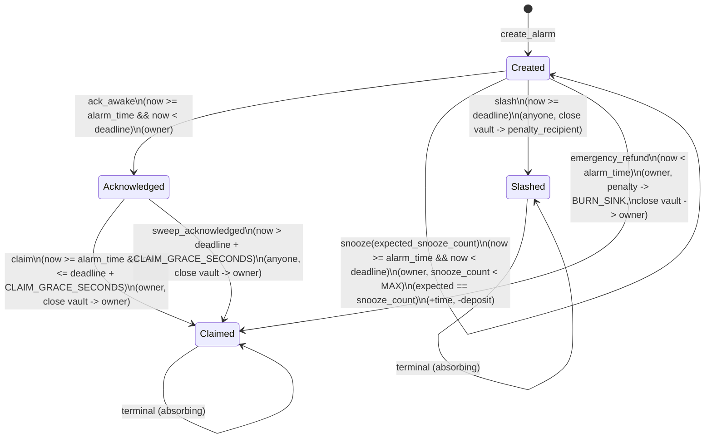

# Solarma Vault — State Machine

This document describes the on-chain alarm lifecycle for
`programs/solarma_vault`, including valid transitions and the clock-based
conditions (time windows).

## States

- `Created`: alarm exists and is live.
- `Acknowledged`: owner has recorded on-chain wake acknowledgement (H3).
- `Claimed`: terminal, vault closed to owner.
- `Slashed`: terminal, vault closed to penalty recipient.

## Time Windows

Let `now = Clock::get()?.unix_timestamp`:

- Refund window: `now < alarm_time`
  - `emergency_refund` is allowed.
- Active window: `alarm_time <= now < deadline`
  - `ack_awake`, `snooze` are allowed (subject to status/authority).
- Post-deadline ACK flow (only when `status == Acknowledged`)
  - Claim grace: `deadline <= now <= deadline + CLAIM_GRACE_SECONDS`
    - `claim` is allowed (owner only).
  - Sweep: `now > deadline + CLAIM_GRACE_SECONDS`
    - `sweep_acknowledged` is allowed (permissionless).
- Slash window (only when `status == Created`): `now >= deadline`
  - `slash` is allowed (subject to routing; Buddy has a short buddy-only window).

Boundary conditions (important for tests):

- At `now == alarm_time`: `ack_awake/snooze` are allowed.
- At `now == deadline`: `ack_awake/snooze` are not allowed. `slash` is allowed
  for `Created` alarms, and `claim` is allowed for `Acknowledged` alarms.
- At `now == deadline + CLAIM_GRACE_SECONDS`: `claim` is still allowed for
  acknowledged alarms, sweep is not.

## Transitions (Mermaid)

## Side Effects Summary

- `create_alarm`
  - Initializes `Alarm` + `Vault` PDAs.
  - Optional: transfers `deposit_amount` lamports from owner to vault.
- `snooze`
  - Deducts an exponential penalty from the vault to `BURN_SINK` (rent-guarded).
  - Increments `snooze_count`.
  - Extends both `alarm_time` and `deadline` by `DEFAULT_SNOOZE_EXTENSION_SECONDS`.
- `ack_awake`
  - Only records state (`Created -> Acknowledged`), no fund movement.
- `claim`
  - Closes the vault to the owner (returns deposit + rent).
  - Sets status to `Claimed` and clears `remaining_amount`.
- `sweep_acknowledged`
  - Permissionlessly closes the vault to the owner after grace expires
    (returns deposit + rent).
  - Sets status to `Claimed` and clears `remaining_amount`.
- `slash`
  - Validates penalty recipient based on route.
  - Closes the vault to the penalty recipient (transfers deposit + rent).
  - Sets status to `Slashed` and clears `remaining_amount`.
- `emergency_refund`
  - Charges a percent penalty to `BURN_SINK` (rent-guarded).
  - Closes the vault to the owner.
  - Sets status to `Claimed` and clears `remaining_amount`.
