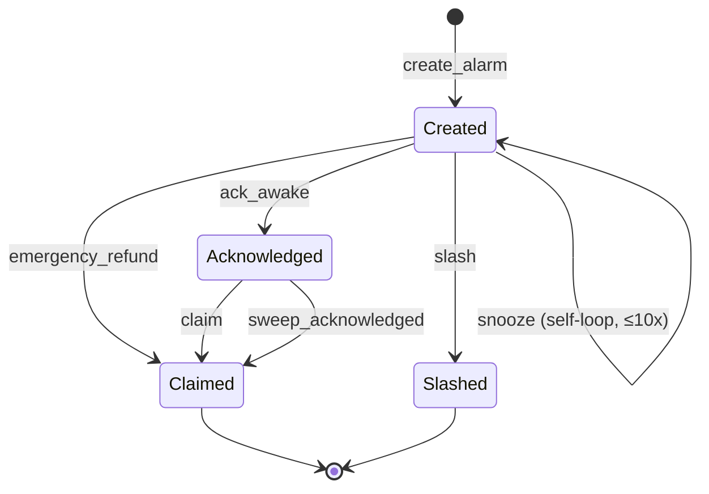

# Solarma Vault — State Machine

## States

| State | Value | Terminal | Description |
|---|---|---|---|
| **Created** | 0 (default) | No | Alarm initialized, deposit held in vault |
| **Acknowledged** | 1 | No | Owner confirmed wake-up on-chain (H3) |
| **Claimed** | 2 | **Yes** | Deposit returned to owner, vault closed |
| **Slashed** | 3 | **Yes** | Deposit sent to penalty recipient, vault closed |

## State Machine Diagram

## Transition Rules

### create_alarm

| Guard | Error |
|---|---|
| `alarm_time > now` | AlarmTimeInPast |
| `deadline > alarm_time` | InvalidDeadline |
| `deposit ≥ MIN_DEPOSIT (if > 0)` | DepositTooSmall |
| `penalty_route ∈ {0,1,2}` | InvalidPenaltyRoute |
| `Donate/Buddy → destination ≠ None` | PenaltyDestinationRequired |

**Signer:** owner.  
**Effect:** Alarm PDA + Vault PDA initialized. SOL transferred to vault.

---

### ack_awake (H3)

| Guard | Error |
|---|---|
| `status == Created` | InvalidAlarmState |
| `has_one = owner` | ConstraintHasOne |
| `now ≥ alarm_time` | TooEarly |
| `now < deadline` | DeadlinePassed |

**Signer:** owner only.  
**Effect:** `status ← Acknowledged`. No fund movement.

---

### claim

| Guard | Error |
|---|---|
| `status == Acknowledged` | InvalidAlarmState |
| `has_one = owner` | ConstraintHasOne |
| `now ≥ alarm_time` | TooEarly |
| `now ≤ deadline + CLAIM_GRACE_SECONDS` | DeadlinePassed |

**Signer:** owner only.  
**Effect:** `status ← Claimed`, `remaining ← 0`. Vault closed → lamports to owner.

---

### snooze

| Guard | Error |
|---|---|
| `status == Created` | InvalidAlarmState |
| `has_one = owner` | ConstraintHasOne |
| `now ≥ alarm_time` | TooEarly |
| `now < deadline` | DeadlinePassed |
| `snooze_count < MAX_SNOOZE_COUNT (10)` | MaxSnoozesReached |
| `expected_snooze_count == alarm.snooze_count` | InvalidAlarmState (H1 idempotency) |
| `cost > 0` | InsufficientDeposit |
| `final_cost > 0 (after rent guard)` | InsufficientDeposit |
| `sink == BURN_SINK` | InvalidSinkAddress |

**Signer:** owner only.  
**Effect:**

- Cost = `remaining × 10% × 2^snooze_count` (capped at remaining, then at available above rent)
- `remaining -= cost`, `snooze_count += 1`
- `alarm_time += 300s`, `deadline += 300s`
- Cost lamports transferred vault → BURN_SINK

---

### slash (permissionless)

| Guard | Error |
|---|---|
| `status == Created` | InvalidAlarmState |
| `now ≥ deadline` | DeadlineNotPassed |
| `penalty_recipient` matches route | InvalidPenaltyRecipient |
| Buddy route: `caller == buddy` during buddy-only window | BuddyOnlyWindow |

**Signer:** anyone (`caller`).  
**Effect:** `status ← Slashed`, `remaining ← 0`. Vault closed → lamports to penalty_recipient.

> **Buddy-only window:** For `PenaltyRoute::Buddy`, during `deadline ≤ now < deadline + BUDDY_ONLY_SECONDS`, only the buddy can slash. After that, slash is permissionless.

---

### sweep_acknowledged (permissionless)

| Guard | Error |
|---|---|
| `status == Acknowledged` | InvalidAlarmState |
| `now > deadline + CLAIM_GRACE_SECONDS` | TooEarly |

**Signer:** anyone.  
**Effect:** `status ← Claimed`, `remaining ← 0`. Vault closed → lamports to owner (no penalty).

---

### emergency_refund

| Guard | Error |
|---|---|
| `status == Created` | InvalidAlarmState |
| `has_one = owner` | ConstraintHasOne |
| `now < alarm_time` | TooLateForRefund |
| `sink == BURN_SINK` | InvalidSinkAddress |

**Signer:** owner only.  
**Effect:**

- Penalty = `remaining × 5%` (capped at available above rent)
- Penalty sent vault → BURN_SINK
- `status ← Claimed`, `remaining ← 0`. Vault closed → remaining lamports to owner.

---

## Invariants

> These MUST hold at all times and should be checked by model-based tests.

### Balance Invariants

1. **I-BAL-1:** `alarm.remaining_amount ≤ alarm.initial_amount`
2. **I-BAL-2:** `vault.lamports ≥ rent_exempt_minimum` (while vault exists)
3. **I-BAL-3:** `Σ(snooze_costs) + remaining_amount ≤ initial_amount`
4. **I-BAL-4:** After claim/slash/refund: `remaining_amount == 0`

### State Invariants

5. **I-STATE-1:** Terminal states (Claimed, Slashed) accept NO further instructions
2. **I-STATE-2:** `snooze_count ≤ MAX_SNOOZE_COUNT` always
3. **I-STATE-3:** `ack_awake` only from Created → Acknowledged (one-way, one-time)
4. **I-STATE-4:** `snooze` only from Created (NOT Acknowledged)

### Time Invariants

9. **I-TIME-1:** `alarm_time < deadline` always
2. **I-TIME-2:** After snooze: `new_alarm_time == old_alarm_time + 300s`
3. **I-TIME-3:** `emergency_refund` impossible once `now ≥ alarm_time`
4. **I-TIME-4:** `claim` impossible once `now > deadline + CLAIM_GRACE_SECONDS`

### Permission Invariants

13. **I-PERM-1:** Only owner can: claim, snooze, ack_awake, emergency_refund
2. **I-PERM-2:** Anyone can: slash (after deadline)
3. **I-PERM-3:** Slash penalty_recipient must match alarm's route + destination
