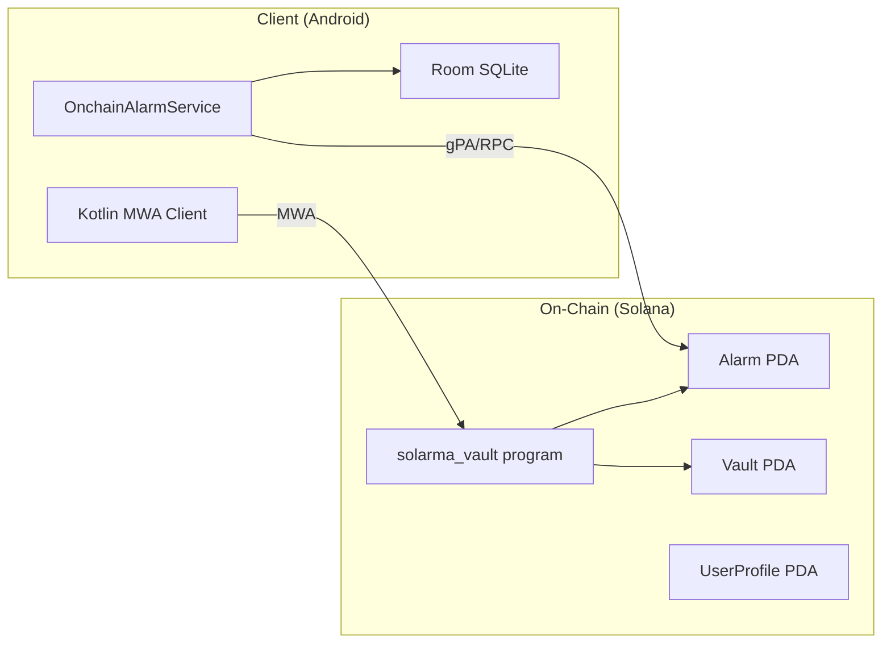

# Solarma Vault — Testing Strategy

## System Components & Critical Risks

### Architecture



### Risk Matrix

| Risk Category | Severity | Example Failure | Affected Instructions |
|---|---|---|---|
| **💰 Money** | CRITICAL | Vault drained below rent → GC'd → funds lost | snooze, emergency_refund |
| **⏱ Time** | CRITICAL | Claim after deadline, slash before deadline | claim, slash, snooze, ack_awake, emergency_refund |
| **🔄 State** | HIGH | Double-claim, snooze on Claimed alarm | All state-changing |
| **🔐 Permissions** | HIGH | Non-owner claims, wrong penalty recipient | claim, snooze, emergency_refund, slash |
| **🧮 Math** | HIGH | Overflow in snooze cost, penalty rounds to 0 | snooze, emergency_refund |
| **🔗 Integration** | MEDIUM | Client alarm_id/status mismatch with on-chain | Sync, client↔program |
| **♻️ Idempotency** | MEDIUM | Retry causes double-snooze | snooze (H1 guard) |

---

## Testing Pyramid

```
                   ┌──────────────┐
                   │   Scenario   │  4-5 end-to-end flows
                   │   (TS)       │  (README lifecycles)
                   ├──────────────┤
                   │  Model /     │  1 random action-sequence
                   │  Property    │  generator + invariant checker
                   ├──────────────┤
                   │ Integration  │  68 Anchor TS tests
                   │ (per-ix)     │  1 happy + 3-5 negative each
                   ├──────────────┤
                   │   Unit       │  22 Rust `cargo test`
                   │   (math)     │  constants, formulas, overflow
                   └──────────────┘
```

### Layer Responsibilities

| Layer | Runtime | Focus | Target Count |
|---|---|---|---|
| **Unit (Rust)** | `cargo test` (~1s) | Math formulas, account sizes, overflow, enum safety | 22 ✅ (done) |
| **Integration (TS)** | `anchor test` (~4min) | Per-instruction happy/negative, access control, timing, state | 68 ✅ (done) |
| **Scenario (TS)** | `anchor test` | Multi-step README flows end-to-end | 5 (to add) |
| **Model-based (TS)** | `anchor test` | Random ix sequences, invariant checking | 1 (to add) |
| **Property (Rust)** | `cargo test` | Penalty formula ↔ reference model, balance conservation | 3 (to add) |

---

## Current Coverage Assessment

### ✅ Well-Covered
- All 7 instructions have happy-path tests
- All 14 error codes tested (at least 1 trigger each)
- Access control (`has_one` constraints) for claim/snooze/refund
- Timing guards (TooEarly, DeadlinePassed, TooLateForRefund)
- State constraints (InvalidAlarmState for each terminal state)
- Penalty route validation (Burn/Donate/Buddy with correct/wrong recipients)
- Idempotency guard (H1: expected_snooze_count)
- Boundary values (MIN_DEPOSIT, PDA collision)

### ❌ Gaps to Fill (Phase B)
1. **No formal scenario tests** — lifecycle flows exist ad-hoc but not as a dedicated suite
2. **No model-based / state-machine test** — no random sequence with invariant checking
3. **No property-based tests** — penalty formula not cross-validated with reference impl
4. **Missing: snooze ×N → drain → claim** (vault fully drained scenario)
5. **Missing: snooze → slash from Acknowledged** (exact balance assertion)
6. **No coverage metrics** — CI doesn't measure or gate on coverage
7. **Client↔program schema test** missing (Borsh layout parity)

---

## CI Architecture

```
┌─────────────────────────────────────────────────────┐
│ CI Pipeline (GitHub Actions, on PR + push)           │
│                                                     │
│  Job 1: security (Gitleaks)                         │
│  Job 2: rust-checks (fmt → clippy → cargo test)    │
│  Job 3: anchor (build → test --skip-build fast)     │ 
│  Job 4: android (lint → unit tests → assembleDebug) │
└─────────────────────────────────────────────────────┘
```

**Current timing:** ~8 min total (anchor job dominates at ~6 min)
**Target:** Stay under 10 min with new tests.

### CI Improvements (Phase B)
- Add `--grep @model` for model tests (run in full suite only)
- Add coverage via `tarpaulin` for Rust unit tests
- Enforce minimum Rust test count in CI script
